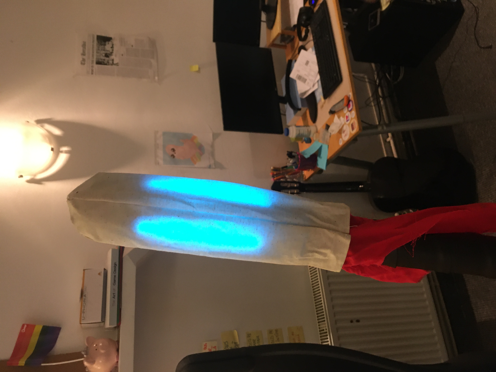
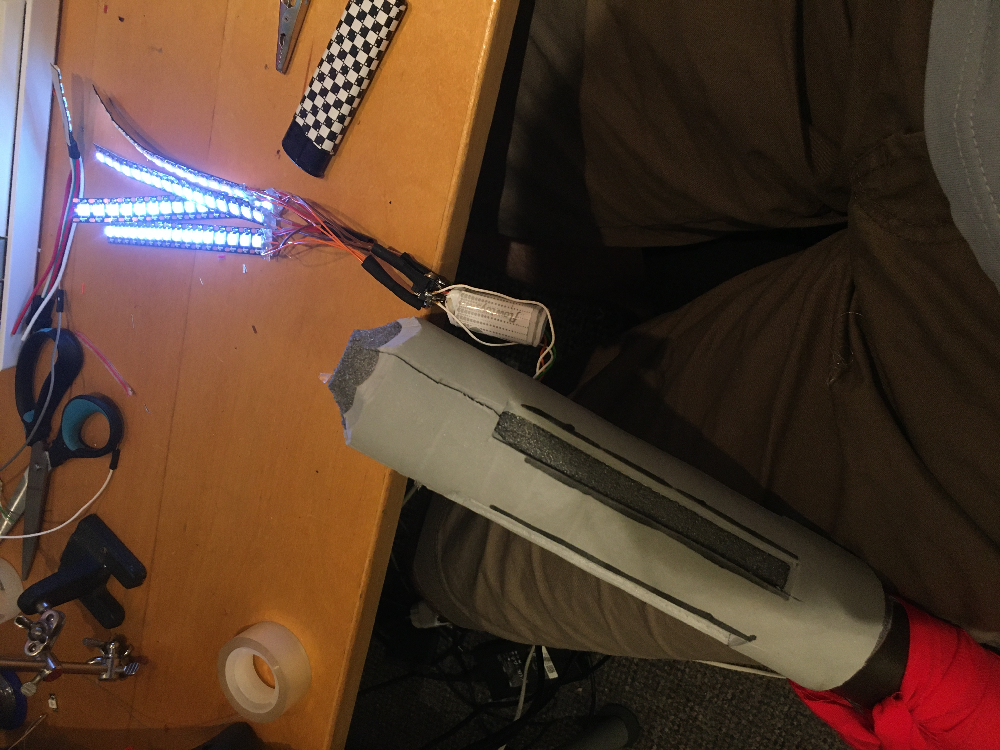

# RGB Staff

This is an Arduino sketch for a glowy LARP staff.

## Hardware:

* [ATTiny85](https://ww1.microchip.com/downloads/en/devicedoc/atmel-2586-avr-8-bit-microcontroller-attiny25-attiny45-attiny85_datasheet.pdf)
* 16-LED WS2812B (Neopixel) strip (or 4 of them driven from the same data pin)
* A button
* 0.1uF capacitor between the ATTiny's VCC and GND
* 300-500 Ohm resistor in series with the LED strip's data pin, as recommended [here][adafruit-guide].
* Some moderately beefy Li-Poly battery. See LED power requirements [here][adafruit-guide].

[adafruit-guide]: https://learn.adafruit.com/adafruit-neopixel-uberguide/powering-neopixels

See the pin definitions in the sketch's header before wiring it up. Also don't forget to connect RESET to VCC.

## Software:

* Arduino IDE
* https://github.com/SpenceKonde/ATTinyCore

## Usage:

Single quick press to power on/off.

There are 10 pattern slots:
* Long press for pattern 1
* Quick press N times for pattern N

If you long press and keep pressing, when you release it will switch back from pattern 1 to the previous pattern.
(To achieve a momentary effect)

To configure the current pattern, quick press 3 times, then long press. 
It will start cycling through different settings. 
Single quick press to commit to a setting and move to the next one.

The settings are, in order:
1. Main color: Select from hue wheel or white.
2. Brightness: Select between a default of 30% or a custom value.
3. Animation intensity (jitter): Select from a default of 40% or a custom value.
4. Animation accent color: Select from: main color, hue wheel or white.

Quickly pressing once, then long pressing will start a 5 minute timer at the end of which, the staff will power off (useful to know when your spell effect ends).

Quickly pressing twice, then long pressing will start a 1 minute timer.

Quickly pressing 4 times, then long pressing will bring up a battery meter.

## Demo:

Animation pattern demo: https://www.shadertoy.com/view/flXXzM

